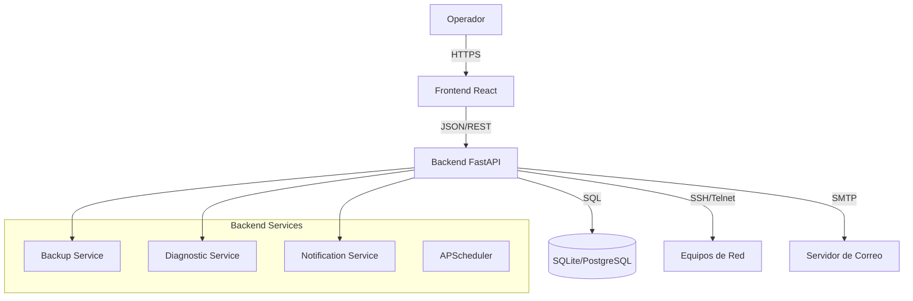

# Arquitectura del Sistema

## Visión General

El Backup Manager sigue una arquitectura **Cliente-Servidor** desacoplada, diseñada para ser modular y escalable.

### Diagrama Conceptual

## Componentes

### 1. Backend (Python/FastAPI)
El núcleo del sistema. Expone una API RESTful y maneja la lógica de negocio.

- **API Layer (`app/api/`)**: Endpoints HTTP.
- **Service Layer (`app/services/`)**: Lógica de negocio pura.
    - `BackupService`: Implementa el patrón *Strategy* para manejar diferentes vendors (Huawei, Cisco, etc.) de manera uniforme.
    - `DiagnosticService`: Ejecuta herramientas del sistema (`ping`, `traceroute`) de forma segura.
    - `NotificationService`: Maneja el envío de correos.
- **Data Layer (`app/models/`)**: Definición de esquemas usando **SQLModel** (ORM).

### 2. Frontend (React/Vite)
Interfaz de usuario moderna y responsiva.

- **Tecnologías**: React, TailwindCSS, React Query.
- **Enfoque**: "Autodescriptivo". La UI incluye ayudas contextuales y explicaciones para reducir la curva de aprendizaje.

### 3. Base de Datos
- Por defecto usa **SQLite** para facilitar el despliegue (archivo único).
- Puede migrarse a **PostgreSQL** simplemente cambiando la cadena de conexión, gracias a SQLModel/SQLAlchemy.

## Flujos Principales

### Ejecución de Backup
1. El `Scheduler` (o el usuario manualmente) dispara un backup para un `Device`.
2. `BackupService` selecciona la estrategia adecuada según el `vendor` del equipo.
3. Se conecta al equipo usando `Netmiko` (SSH/Telnet).
4. Extrae la configuración (o solicita transferencia TFTP).
5. Guarda el archivo en el sistema de archivos (`/opt/backup-manager/backups/...`).
6. Registra el resultado en la BD.
7. Si falla:
    - `DiagnosticService` ejecuta ping/traceroute.
    - Se guarda el diagnóstico junto con el error.
    - `NotificationService` envía una alerta si está configurado.

## Seguridad
- Las credenciales de los equipos se almacenan en la base de datos. *Recomendación: Encriptar en reposo en versiones futuras.*
- La comunicación Frontend-Backend debe ser protegida por HTTPS (configurado en Nginx).
